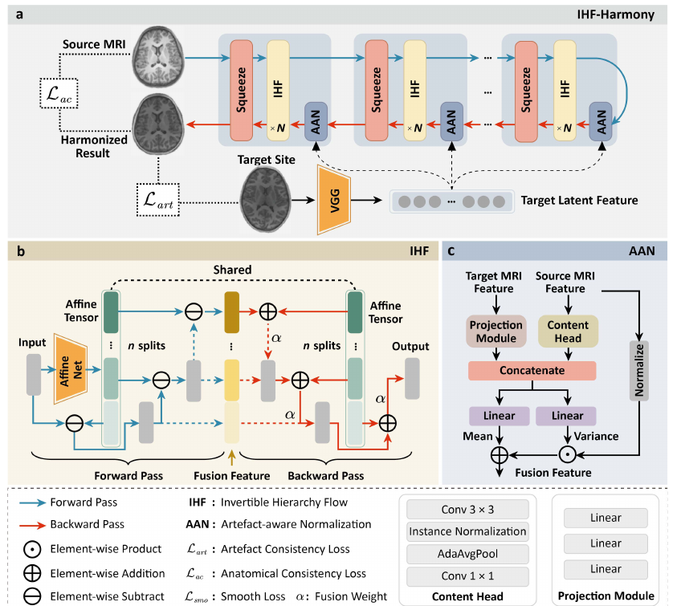

# IHF-Harmony

PyTorch implementation of **IHF-Harmony: Multi-Modality Magnetic Resonance
Images Harmonization using Invertible Hierarchy Flow Model**.

This project is built on and adapted from
[HierarchyFlow](https://github.com/WeichenFan/HierarchyFlow), with the original
CV image-to-image translation framework modified for unpaired medical MRI
harmonization.



## Main Changes

- Reorganized the code into a cleaner MRI harmonization pipeline.
- Added CPU smoke-test support and GPU/DDP training support in one entry point.
- Reworked data loading for unpaired source/target MRI slice lists.
- Implemented manuscript-aligned IHF blocks, artifact-aware normalization, and
  VGG-based anatomy/artifact consistency losses.
- Added lightweight demo data lists while keeping raw image folders,
  checkpoints, outputs, and VGG weights out of git.

## Code Structure

| Path | Description |
| --- | --- |
| `main.py` | Training/evaluation entry point. |
| `configs/config.yaml` | Default GPU-oriented training config. |
| `configs/debug.yaml` | Small CPU debug config. |
| `model/network/hf.py` | IHF-Harmony model, IHF block, and AAN module. |
| `model/losses/VGG_loss.py` | Anatomy and artifact consistency losses. |
| `model/trainers/hf_trainer.py` | Training, evaluation, checkpointing, AMP, DDP. |
| `model/utils/dataset.py` | Unpaired MRI slice dataset. |
| `tools/smoke_test.py` | Minimal forward/backward test. |

## Environment

```bash
pip install -r requirements.txt
```

For CUDA training, install the PyTorch version matching your GPU driver first.

The VGG loss expects the encoder weights at:

```text
model/losses/vgg_model/vgg_normalised.pth
```

This prepared upload folder includes the file so the smoke test can run
directly. If you remove it from a public release, place the same file back at
this path before training or evaluation.

## Data

The demo split uses 30 local slices per site:

| Site | Train | Test |
| --- | ---: | ---: |
| HUH | 24 | 6 |
| COI | 24 | 6 |

Expected layout:

```text
datasets/
  HUH/train.txt
  HUH/test.txt
  COI/train.txt
  COI/test.txt
  image/siteHUH_slice/
  image/siteCOI_slice/
```

For full experiments, place the complete image folders under `datasets/image/`
and regenerate the four list files.

## Run

CPU smoke test:

```bash
python tools/smoke_test.py --config configs/debug.yaml --device cpu
python main.py --config configs/debug.yaml --device cpu
```

Single-GPU training:

```bash
python main.py --config configs/config.yaml --device cuda
```

Multi-GPU training:

```bash
torchrun --nproc_per_node=4 main.py --config configs/config.yaml
```

Evaluation:

```bash
python main.py --config configs/config.yaml --eval-only --load-path output_dir/harmonization/model_save/final.ckpt.pth.tar
```

## Citation

If you use this code, please cite:

```bibtex
@article{zhu2026ihf,
  title={IHF-Harmony: Multi-Modality Magnetic Resonance Images Harmonization using Invertible Hierarchy Flow Model},
  author={Zhu, Pengli and Zhu, Yitao and Pang, Haowen and Qiu, Anqi},
  journal={arXiv preprint arXiv:2602.21536},
  year={2026}
}
```

This implementation is based on
[WeichenFan/HierarchyFlow](https://github.com/WeichenFan/HierarchyFlow) and
extends it to the MRI harmonization setting.
